# Media Lake Installation & Integration Guide

## 1. Base Installation

### Deploy via CloudFormation

1. **Open AWS Console** and switch to your desired region.
2. Go to **CloudFormation** > click **Create Stack** > **With new resources (standard)**.
   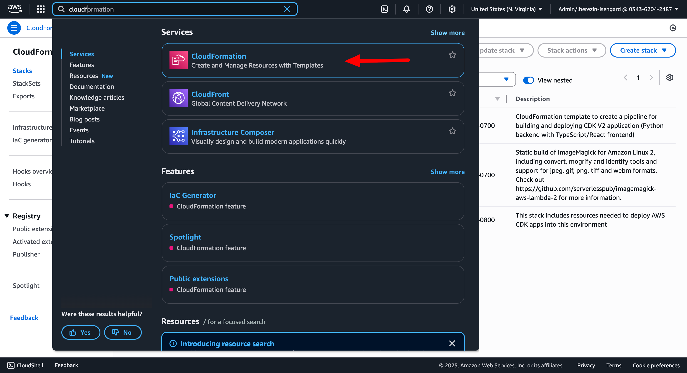
3. Choose **Upload a template file**, select `medialake.template`, and click Next.
   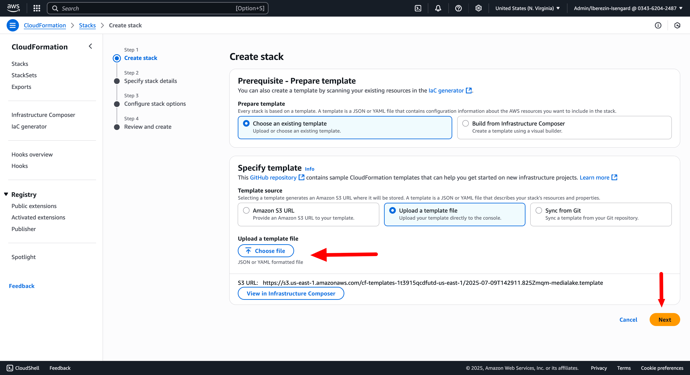
   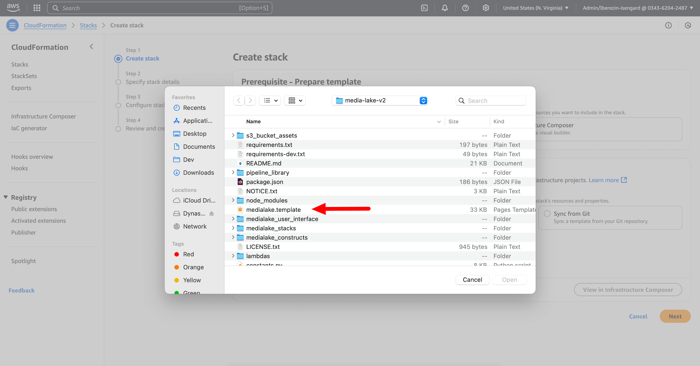
4. **Configure Stack and Media Lake Settings**:
   - **Stack Name**: Name the stack `medialake-cf`
     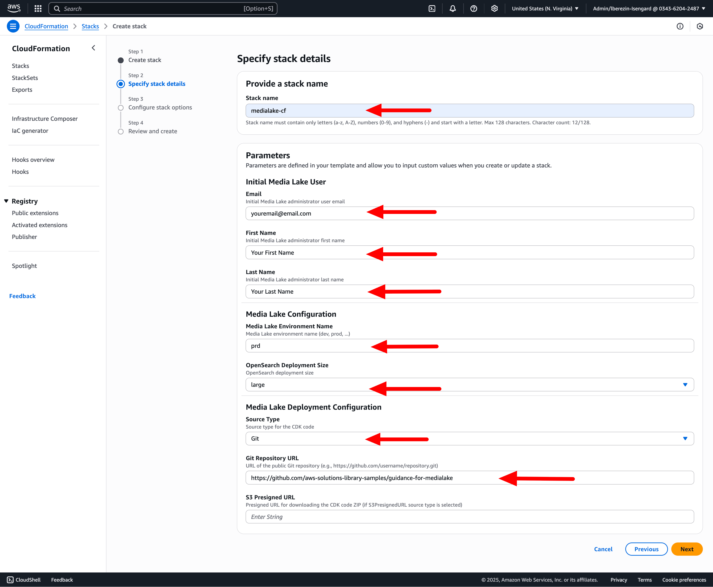

   - **Configure Initial Media Lake User**:
     - **Email** (`InitialUserEmail`): Enter your email address to receive a welcome email (required)
     - **First Name** (`InitialUserFirstName`): Enter the administrator's first name (1-50 characters, letters/spaces/hyphens/periods only)
     - **Last Name** (`InitialUserLastName`): Enter the administrator's last name (1-50 characters, letters/spaces/hyphens/periods only)

   - **Configure Media Lake Settings**:
     - **Media Lake Environment Name** (`MediaLakeEnvironmentName`): Set environment identifier (1-10 alphanumeric characters, default: `dev`)
     - **OpenSearch Deployment Size** (`OpenSearchDeploymentSize`): Choose deployment size:
       - `small` - Suitable for development and testing environments
       - `medium` - Recommended for moderate production workloads
       - `large` - Designed for high-volume production environments

   - **Configure Media Lake Deployment**:
     - **Source Type** (`SourceType`): **Select "Git"** (recommended default) unless specifically instructed to use S3PresignedURL:
       - **Git** - Deploy directly from a public Git repository (use this option)
       - **S3PresignedURL** - Deploy from a ZIP file via presigned URL (only use if provided with a specific presigned URL)
     - **Git Repository URL** (`GitRepositoryUrl`): Use the default repository URL: `https://github.com/aws-solutions-library-samples/guidance-for-medialake`
     - **S3 Presigned URL** (`S3PresignedURL`): Only fill this if you selected S3PresignedURL source type and have been provided with a specific presigned URL (required when using S3PresignedURL source type)

5. Acknowledge required checkboxes, hit **Next**, then **Submit**.
   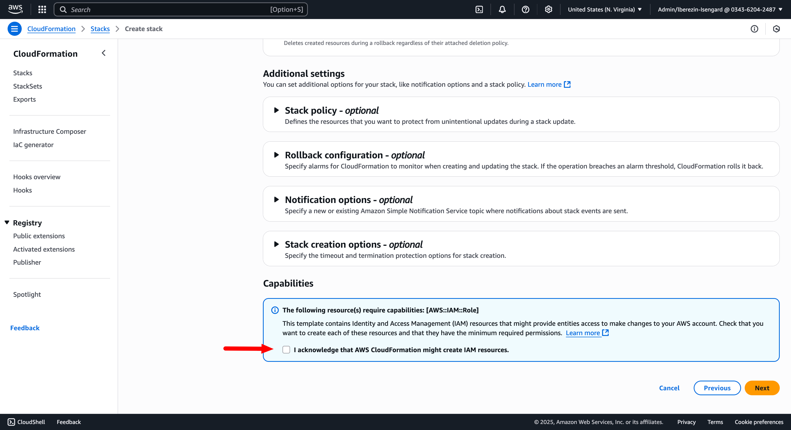
   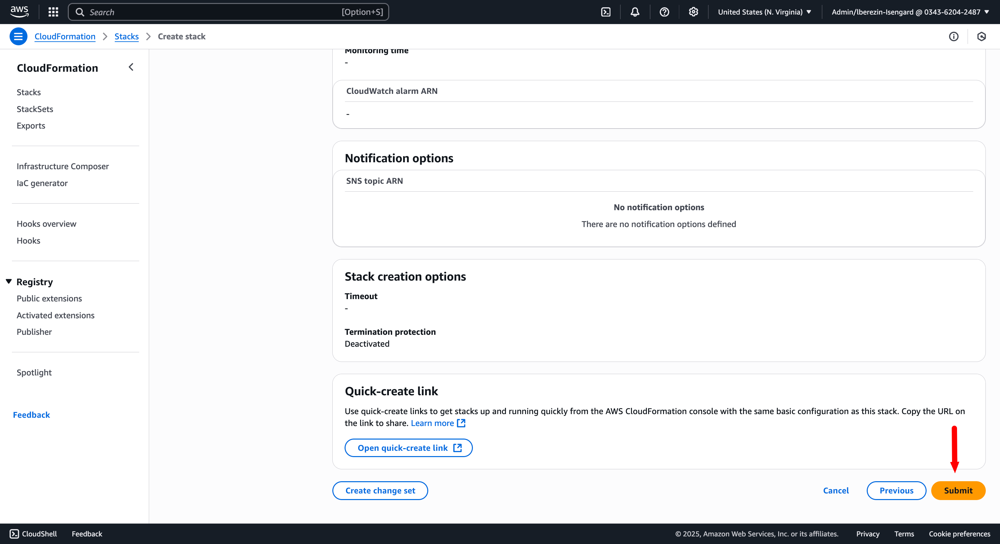
6. After provisioning, you'll receive login details by email.

---

## 2. Storage Connector Setup

After deployment, you'll need to configure storage connectors to connect media lake to your data sources.

### 2.1 Initial Login

1. **Access Media Lake**: Use the login credentials sent to your email after deployment
   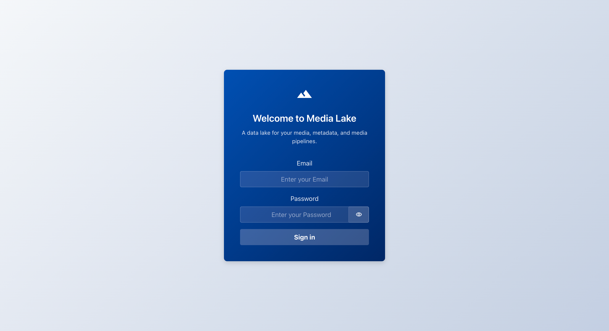
2. **Navigate to the media lake web interface** using the URL provided in the deployment completion email

### 2.2 Configure S3 Storage Connectors

1. **Navigate to Connectors**:
   - Log in to media lake
   - Go to **Settings** > **Connectors**
   - Click **Add Connector**
     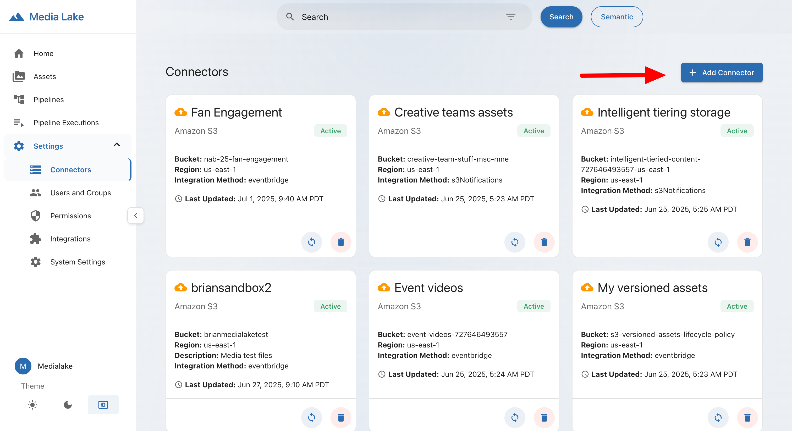

2. **Configure Connector Settings**:

   **Step 1: Select Type**
   - Choose **Amazon S3**
   - Click **Next** to proceed
     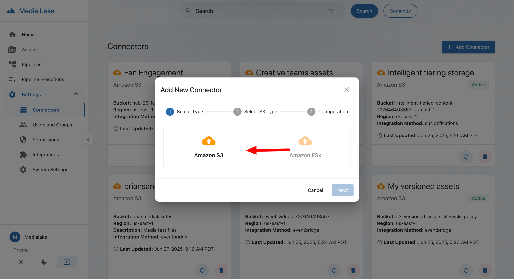

   **Step 2: Select S3 Type**
   - Choose your S3 bucket option:
     - **Existing S3 Bucket**: Connect to an existing S3 bucket
     - **New S3 Bucket**: Create a new S3 bucket
   - Click **Next** to proceed
     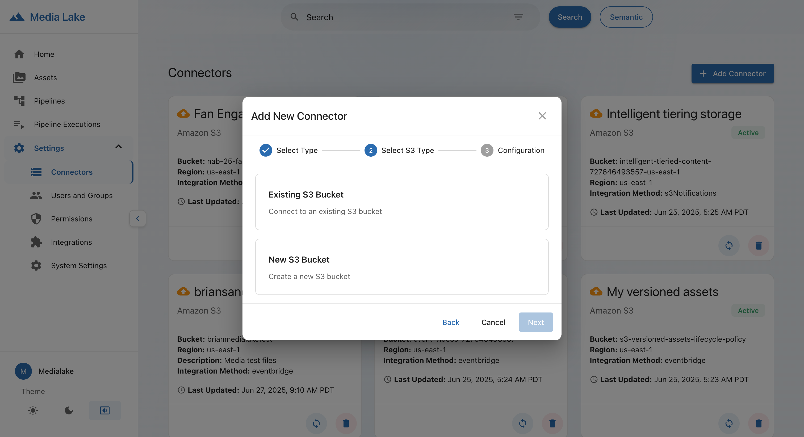

   **Step 3: Configuration**

   **For Existing S3 Bucket:**
   - **Connector Name**: Enter a descriptive name for your connector
   - **Description**: Add an optional description for the connector
   - **S3 Connector Type**: Select from the dropdown options
   - **S3 Integration Method**: Choose the integration method from available options
   - **S3 Bucket**: Select your existing bucket from the dropdown list
   - **Object Prefix** (optional): Add single or multiple prefixes to ensure content will only be ingested from specific locations in your bucket (e.g., 'media/', 'videos/2024/')
     - Click **Add Prefix** to add additional prefixes if needed
       

   > **Note**: If you have existing assets in the bucket, you can optionally use sync to ingest the content. After creating the connector, navigate back to the Connectors list, find your connector, and click the sync button to perform an initial scan of existing media files.

   **For New S3 Bucket:**
   - **Connector Name**: Enter a descriptive name for your connector
   - **Description**: Add an optional description for the connector
   - **S3 Connector Type**: Select from the dropdown options
   - **S3 Integration Method**: Choose the integration method from available options
   - **New Bucket Name**: Enter the S3 bucket name (must be globally unique and follow S3 naming rules)
   - **Object Prefix** (optional): Add single or multiple prefixes to ensure content will only be ingested from specific locations in your bucket (e.g., 'media/', 'videos/2024/')
     - Click **Add Prefix** to add additional prefixes if needed
       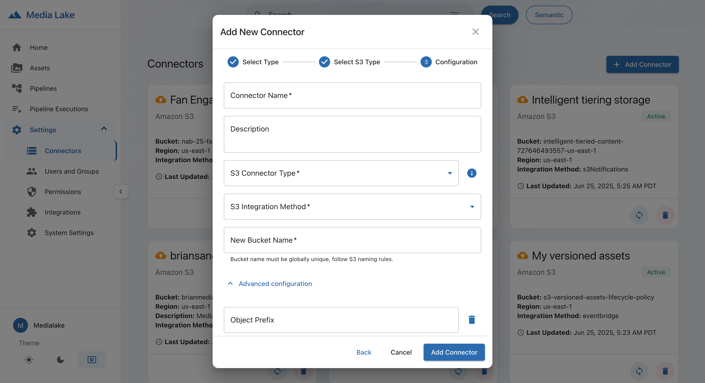
       > **Important**: New S3 buckets created through media lake will need to be manually emptied and deleted during cleanup as they are not automatically removed when the media lake stack is deleted.

3. **Complete Setup**:
   - Review your configuration settings
   - Click **Add Connector** to create the connector

### 2.3 Verify Setup

1. **Add a Supported Media File**: Upload a test media file to your S3 bucket to verify the connector is working. Media lake supports the following file types:

   **Audio Files**: WAV, AIFF/AIF, MP3, PCM, M4A

   **Video Files**: FLV, MP4, MOV, AVI, MKV, WEBM, MXF

   **Image Files**: PSD, TIF, JPG/JPEG, PNG, WEBP, GIF, SVG

2. **Browse Assets**: Navigate to the **Assets** section to verify that files from your S3 bucket are visible

3. **Check Metadata**: Verify that file metadata is being extracted correctly

---

## 3. Semantic Search & Integrations

- **Enable Semantic Search**:
  - Configure your semantic search provider in media lake.
  - **Embedding Store Selection**: Media lake supports both OpenSearch and S3 Vectors as embedding stores. While S3 Vectors offers a cost-effective option and is currently in preview mode, **For production deployments, OpenSearch is recommended** for enhanced reliability and performance.
  - Add and configure the **Twelve Labs** integration.

- **Import Processing Pipelines**:
  - Navigate to the **Pipelines** menu and click the **Import pipelines** button.
    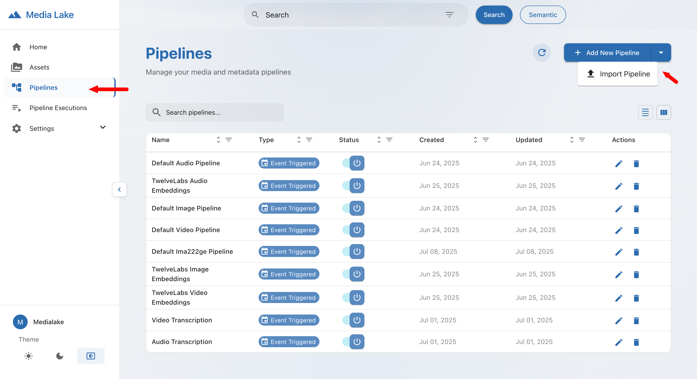
  - In the file selection dialog, choose from the available pipelines in the [`pipeline_library`](../../pipeline_library/) directory:

    **Twelve Labs AI Enhancement Pipelines:**
    - [`Twelve Labs API Audio Embedding to OpenSearch.json`](../../pipeline_library/Twelve%20Labs%20API%20Audio%20Embedding%20to%20OpenSearch.json) - Generate audio embeddings for semantic search
    - [`Twelve Labs API Video Embedding to OpenSearch.json`](../../pipeline_library/Twelve%20Labs%20API%20Video%20Embedding%20to%20OpenSearch.json) - Generate video embeddings for semantic search
    - [`Twelve Labs API Image Embedding to OpenSearch.json`](../../pipeline_library/Twelve%20Labs%20API%20Image%20Embedding%20to%20OpenSearch.json) - Generate image embeddings for semantic search

    **Transcription Pipelines:**
    - [`Audio Transcription.json`](../../pipeline_library/Audio%20Transcription.json) - Audio transcription using Amazon Transcribe with Bedrock summarization
    - [`Video Transcription.json`](../../pipeline_library/Video%20Transcription.json) - Video transcription using Amazon Transcribe with Bedrock summarization

  - You can import individual pipelines based on your media types (audio, video, image) or import all pipelines for comprehensive processing capabilities.
  - You can also import other pipelines from the library as needed for your specific use case.

- **Ingest Content**:
  - Upload assets to the connected S3 buckets to trigger the imported pipelines.

---

## 4. Incremental Updates

### For Git Source Type (Recommended)

Media lake automatically stays up-to-date when using the Git source type deployment method. The system pulls the latest code from the GitHub repository during each deployment.

To trigger an update with the latest media lake features and improvements, simply redeploy using the same CloudFormation steps from [Section 1. Base Installation](#1-base-installation):

1. Follow the **Deploy via CloudFormation** steps (steps 1-6) from the Base Installation section above
2. Use the same stack name `medialake-cf` - CloudFormation will update the existing stack
3. The deployment will automatically pull the latest version from the GitHub repository and update your media lake instance

### For S3PresignedURL Source Type (Alternative)

If you deployed using the S3PresignedURL source type, you can update by redeploying with a new presigned URL:

1. Follow the same CloudFormation deployment steps from [Section 1. Base Installation](#1-base-installation)
2. In step 4, update the **S3 Presigned URL** field with the latest presigned URL provided to you
3. Use the same stack name `medialake-cf` to update the existing deployment

---

## 5. SAML Integration

- Create the media lake app in your identity provider (Okta, etc.).
- Use placeholder URLs for SSO endpoints initially.
- After deployment, copy your Cognito **User Pool ID** and **domain** from AWS Cognito.
  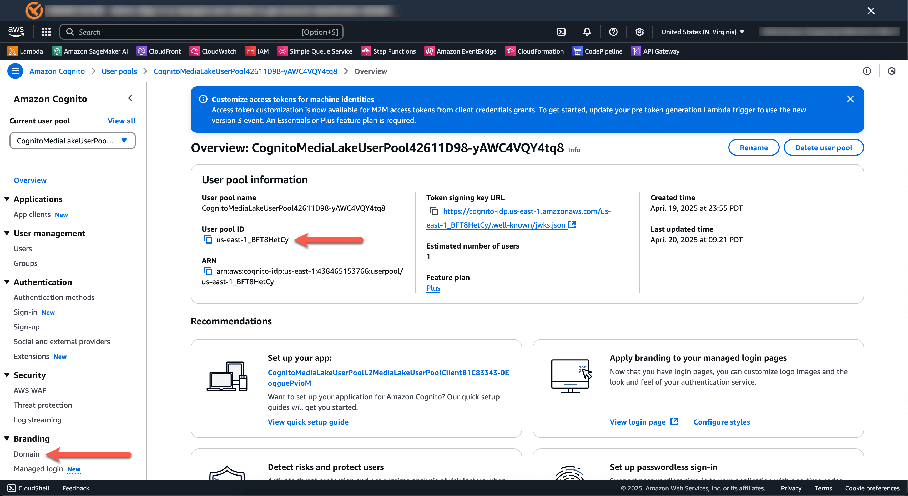
- Navigate to the Cognito domain configuration.
  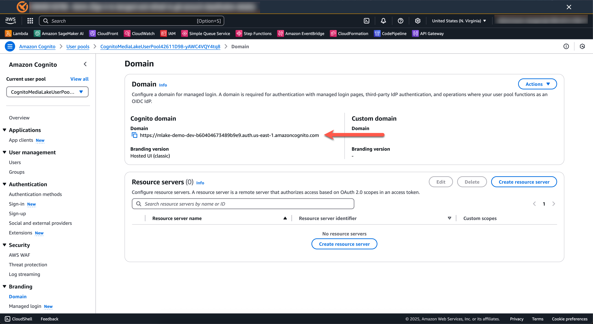
- Set up SAML metadata, audience URI, and relay state using the provided format and IDs.
- Map attributes:
  - `emailaddress` → user.email
  - `surname` → user.lastName
  - `givenname` → user.firstName
  - `role` → user.role

---

## 6. Pipelines & Integration Creation

- **Create Integrations**:
  - Log in > go to **Integrations** > add/configure required third-party integrations.
- **Import Pipelines**:
  - Go to **Pipelines** > **Import**.
  - Assign credentials if required for specific nodes.

---

## 7. Full Redeploy / Stack Cleanup

- In CloudFormation, delete all stacks prefixed with `Media Lake` and `medialake-cf`.
  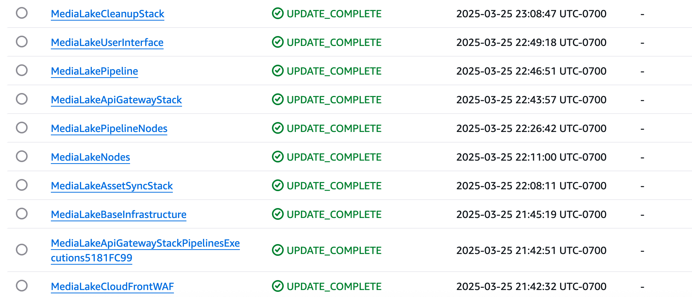
- **Important for S3 Buckets**: For new buckets created via media lake, you must manually empty and delete them as they are not automatically cleaned up during stack deletion.
- If you encounter dependency errors, retry after deleting prerequisite stacks.
- When clean, redeploy using the base install steps above.

---

## 8. Troubleshooting & Additional Notes

- Ensure all required integrations are configured **before** importing or running pipelines.
- For development, MacOS, Windows, and Linux are supported.
- Some AWS resources may require manual deletion if cleanup fails.
- Check for CloudFormation errors and remove orphaned resources as needed.

---
