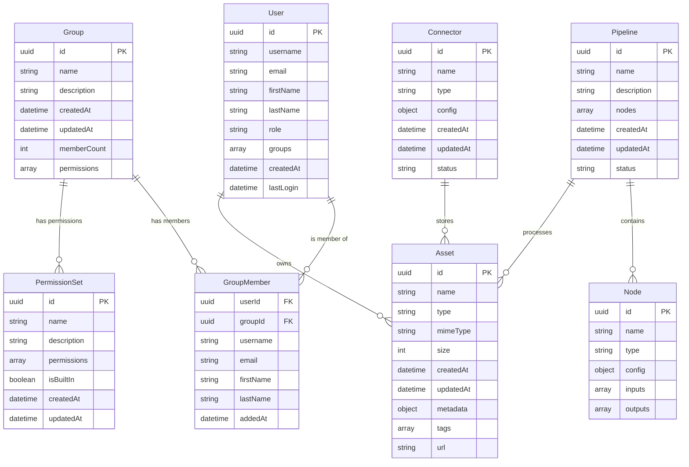

# MediaLake API Entity Relationship Diagram

This document presents the Entity Relationship Diagram (ERD) for the MediaLake API, derived from the OpenAPI specification.

## Entity Relationship Diagram



## Entity Descriptions

1. **User**: Represents a user of the MediaLake system.
   - Primary attributes: id, username, email, firstName, lastName, role
   - Relationships: Can be a member of multiple groups, can own multiple assets

2. **Group**: Represents a collection of users with similar permissions.
   - Primary attributes: id, name, description, memberCount, permissions
   - Relationships: Contains multiple group members, has multiple permission sets

3. **GroupMember**: Represents the relationship between users and groups.
   - Primary attributes: userId, groupId, username, email, firstName, lastName, addedAt
   - Relationships: Links a user to a group

4. **PermissionSet**: Represents a collection of permissions that can be assigned to groups.
   - Primary attributes: id, name, description, permissions, isBuiltIn
   - Relationships: Associated with groups

5. **Asset**: Represents a media asset in the system.
   - Primary attributes: id, name, type, mimeType, size, metadata, tags, url
   - Relationships: Owned by a user, stored by a connector, processed by pipelines

6. **Connector**: Represents a storage connector for assets.
   - Primary attributes: id, name, type, config, status
   - Relationships: Stores multiple assets

7. **Pipeline**: Represents a processing workflow for assets.
   - Primary attributes: id, name, description, status
   - Relationships: Contains multiple nodes, processes multiple assets

8. **Node**: Represents a processing step in a pipeline.
   - Primary attributes: id, name, type, config, inputs, outputs
   - Relationships: Part of a pipeline

## How to Render Mermaid Diagrams

Mermaid diagrams can be rendered in various ways:

### 1. GitHub Markdown

GitHub natively supports Mermaid diagrams in markdown files. Simply commit this file to a GitHub repository, and the diagram will be rendered automatically.

### 2. VS Code with Mermaid Extension

1. Install the "Markdown Preview Mermaid Support" extension in VS Code
2. Open this markdown file
3. Use the "Markdown: Open Preview" command to view the rendered diagram

### 3. Include in HTML

```html
<script src="https://cdn.jsdelivr.net/npm/mermaid/dist/mermaid.min.js"></script>
<script>
  mermaid.initialize({ startOnLoad: true });
</script>

<div class="mermaid">
  <!-- Paste the Mermaid code here (without the triple backticks) -->
</div>
```

### 5. Documentation Tools

Many documentation tools like Docusaurus, VuePress, and others have plugins or built-in support for Mermaid diagrams.

## Notes on the ERD

- The ERD represents the main entities and their relationships in the MediaLake API.
- The diagram is based on the schema definitions in the OpenAPI specification.
- Some relationships might be simplified or inferred based on the available information.
- Additional relationships might exist in the actual implementation that are not explicitly defined in the API specification.
