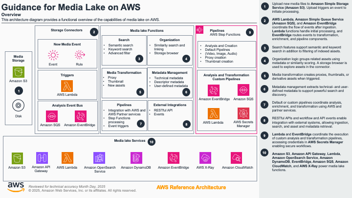
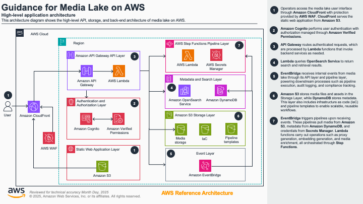
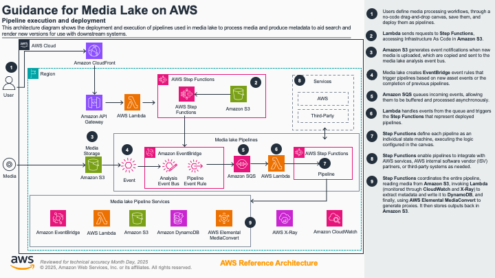

# Guidance for a Media Lake on AWS

> **Table of Contents**
>
> - [Overview](#overview)
> - [Cost](#cost)
>   - [Base Services Cost Table](#base-services-cost-table)
>   - [Usage Based Cost Example Table](#usage-based-cost-example-table)
> - [Quick Deployment (CloudFormation)](#quick-deployment-cloudformation)
> - [Development Environment Setup and CDK Deployment](#development-environment-setup-and-cdk-deployment)
>   - [Clone the repository](#1-clone-the-repository)
>   - [Prepare the environment](#2-prepare-the-environment)
>   - [Configure AWS account and region](#3-configure-aws-account-and-region)
>   - [Configuration Setup](#4-configuration-setup)
>   - [Deploy using AWS CDK](#5-deploy-using-aws-cdk)
> - [Development](#development)
>   - [Prerequisites](#prerequisites)
>   - [Operating System](#operating-system)
> - [Deployment Validation](#deployment-validation)
> - [Running the Guidance](#running-the-guidance)
>   - [Login](#1-login)
>   - [Connect Storage](#2-connect-storage)
>   - [Ingest Media](#3-ingest-media)
>   - [Enable Semantic Search and Integrations](#4-enable-semantic-search-and-integrations)
>   - [Process and Retrieve Assets](#5-process-and-retrieve-assets)
> - [Next Steps](#next-steps)
> - [Project Structure](#project-structure)
> - [Key Components](#key-components)
>   - [Storage Connectors](#storage-connectors)
>   - [Processing Pipelines](#processing-pipelines)
>   - [AWS Services Used](#aws-services-used)
> - [Security Features](#security-features)
> - [Supported Media Types](#supported-media-types)
>   - [Audio Files](#audio-files)
>   - [Video Files](#video-files)
>   - [Image Files](#image-files)
> - [Cleanup](#cleanup)
>   - [Manual Cleanup (AWS Console)](#manual-cleanup-aws-console)
> - [FAQ, Known Issues, and Additional Considerations](#faq-known-issues-and-additional-considerations)
> - [Revisions](#revisions)
> - [Notices](#notices)
> - [Authors](#authors)

---

## Overview

**Guidance for a Media Lake on AWS** provides a comprehensive, serverless, and scalable platform for media ingestion, processing, management, metadata management, and workflow orchestration on AWS. Media lake enables you to connect multiple storage sources, known as connectors, ingest and organize media at scale, creating a unified search space for your media. Workflows, knows as pipelines, run customizable processing workflows (such as proxy/thumbnail generation and AI enrichment), and integrate with both AWS native and partner services.

### High-Level Overview



> _Diagram: Media Lake provides a comprehensive serverless platform connecting storage sources, processing pipelines, and enrichment services with secure user interfaces and API endpoints for scalable media management workflows._

### Application Architecture



> _Diagram: Media lake application layer shows the React UI, API Gateway endpoints, Lambda functions, and data flow between Cognito authentication, DynamoDB storage, and OpenSearch indexing for user interactions and asset management._

### Pipeline Execution and Deployment



> _Diagram: Media lake processes media through S3 ingestion, EventBridge routing, Lambda orchestration, Step Functions, and enrichment with metadata, search, and integration endpoints._

---

## Cost

You are responsible for the cost of the AWS services used while running this Guidance.

**Base Infrastructure Cost (without variable workloads):**
As of July 2025, the cost for running this Guidance with the **small deployment configuration** in the **US East (N. Virginia)** region is approximately **$423.62 per month** for the baseline services only.

**Variable Workload Costs:**
Additional costs will be incurred based on actual usage:

- Media processing and enrichment services (Lambda, Step Functions, MediaConvert, TwelveLabs, Transcription)
- Media and Metadata storage (OpenSearch, DynamoDB, S3)
- Interfactions with the user interface and viewing media(CloudFront, Data Transfer Out, Step Functions, Lambda, OpenSearch and DynamoDB queries)

The total monthly cost will vary based on the volume of media processed, storage requirements, and usage patterns.

We recommend creating a **Budget through AWS Cost Explorer** to help manage costs. Prices are subject to change. For full details, refer to the pricing webpage for each AWS service used in this guidance.

### Base Services Cost Table - OpenSearch Deployment

| **Service & Usage**                | **How It Relates to Your Team's Usage**                    | **Estimated Monthly Cost (USD)**                        |
| ---------------------------------- | ---------------------------------------------------------- | ------------------------------------------------------- |
| **Cognito (Users)**                | 50 active users signing in and using the system each month | \$2.00                                                  |
| **OpenSearch Service (Search)**    | Search and index storage and compute                       | t3.small: \$28.72 (1 instance)<br>Storage: \$2.44 (gp3) |
| **OpenSearch Ingestion (OSI)**     | Data ingestion processing units                            | \$350.40 (2 OCUs)                                       |
| **NAT Gateway (VPC)**              | Outbound internet access from VPC                          | \$33.30                                                 |
| **WAF (Web Application Firewall)** | API & web protection (rules + ACLs + requests)             | WebACL: \$5.00<br>Rules: \$2.00                         |
| **TOTAL**                          | **Monthly cost estimate for small deployment**             | **\$423.60**                                            |

### Base Services Cost Table - S3 Vectors Deployment

| **Service & Usage**                | **How It Relates to Your Team's Usage**                    | **Estimated Monthly Cost (USD)** |
| ---------------------------------- | ---------------------------------------------------------- | -------------------------------- |
| **Cognito (Users)**                | 50 active users signing in and using the system each month | \$2.00                           |
| **WAF (Web Application Firewall)** | API & web protection (rules + ACLs + requests)             | WebACL: \$5.00<br>Rules: \$2.00  |
| **TOTAL**                          | **Monthly cost estimate for small deployment**             | **\$9.00**                       |

### Usage Based Cost Example Table

| **Service & Usage**                           | **How It Relates to Your Team’s Usage**                                                                           | **Estimated Monthly Cost (USD)**                                                        |
| --------------------------------------------- | ----------------------------------------------------------------------------------------------------------------- | --------------------------------------------------------------------------------------- |
| **S3 + Step Functions (Uploads)**             | 1,000 new media files uploaded/month, each triggering a workflow                                                  | S3 storage: \$23.55<br>Step Functions: \$2.40                                           |
| **S3/CloudFront (Images, Audio, Video)**      | All users viewing/downloading images, audio, and video each month (aggregate, served via S3 and CloudFront)       | S3 requests: \$0.05 + \$0.40<br>CloudFront data: \$29.75<br>CloudFront requests: \$0.03 |
| **Total Media Downloaded (S3/CloudFront)**    | About 350GB of media files viewed/downloaded per month                                                            | S3 data transfer out: \$45.00                                                           |
| **Web/App Requests (CloudFront)**             | 25,000 clicks or page loads/month through CDN                                                                     | \$0.03                                                                                  |
| **API Gateway (API Requests)**                | 500,000 system actions/searches/uploads per month                                                                 | \$1.75                                                                                  |
| **Lambda (All Automated and API Processing)** | All automated backend tasks, API logic, file processing, and event handling; includes 1,000,000 invocations/month | \~\$13.00                                                                               |
| **Database Usage (DynamoDB)**                 | 200,000 new or updated records per month (write/read/storage)                                                     | Writes: \$18.75<br>Reads: \$7.50<br>Storage: \$25.00                                    |
| **Message Queues (SQS)**                      | 10,000 standard and 1,000 FIFO auto-messages per month                                                            | Standard: \$0.002<br>FIFO: \$0.0005                                                     |
| **Workflow Automations (Step Functions)**     | 1,000 automated workflows (pipelines), 20 steps each every month                                                  | \$2.40                                                                                  |
| **WAF (Web Application Firewall)**            | API & web protection (rules + ACLs + requests)                                                                    | Requests: \$0.30                                                                        |
| **Encryption (KMS)**                          | 311,000 encryption/decryption actions per month                                                                   | \$15.00.00                                                                              |
| **Monitoring/Logging (CloudWatch)**           | Storage, metrics, logs for all services                                                                           | Data: \$7.50<br>Storage: \$0.07                                                         |
| **EventBridge**                               | Event-driven triggers                                                                                             | \$0.01                                                                                  |
| **X-Ray (Tracing)**                           | Distributed trace monitoring                                                                                      | \$5.00                                                                                  |
| **TOTAL**                                     | **Monthly cost estimate for usage-based services**                                                                | **\$197.50**                                                                            |

## Quick Deployment (CloudFormation)

**Recommended for most users** - Deploy media lake quickly using the pre-built CloudFormation template without setting up a development environment.

### Prerequisites

- An AWS account with appropriate permissions to create and manage resources
- Access to the AWS Console

### Deployment Steps

1. **Download the CloudFormation template**
   - Download `medialake.template` from the GitHub repository

2. **Deploy using AWS Console**
   - Go to the AWS Console > CloudFormation > "Create Stack" > "With new resources (standard)"
   - Choose **Upload a template file**, select `medialake.template`
   - Set stack name to `medialake-cf`

3. **Configure template parameters:**

   #### Initial Media Lake User
   - **InitialUserEmail**: Email address for the initial administrator account (required)
   - **InitialUserFirstName**: First name of the initial administrator (1-50 characters, letters/spaces/hyphens/periods only)
   - **InitialUserLastName**: Last name of the initial administrator (1-50 characters, letters/spaces/hyphens/periods only)

   #### Media Lake Configuration
   - **MediaLakeEnvironmentName**: Environment identifier (1-4 alphanumeric characters, default: `dev`)
   - **OpenSearchDeploymentSize**: Controls the size of your OpenSearch cluster
     - `small`: Suitable for development and testing environments
     - `medium`: Recommended for moderate production workloads
     - `large`: Designed for high-volume production environments

   #### Media Lake Deployment Configuration
   - **SourceType**: Deployment source method
     - `Git`: Deploy directly from a public Git repository
     - `S3PresignedURL`: Deploy from a ZIP file via presigned URL
   - **GitRepositoryUrl**: Public Git repository URL (default: AWS Solutions Library media lake repository)
   - **S3PresignedURL**: Presigned URL for ZIP file download (required when using S3PresignedURL source type)

   > **Note:** You can use the default deployment configuration settings without making any changes. The defaults are configured to deploy from the official AWS Solutions Library repository.

4. **Complete deployment**
   - Accept the required IAM capabilities and deploy
   - Monitor the stack creation progress in the CloudFormation console

5. **Initiate deployment**
   - Click "Create stack" to begin the deployment process
   - The initial CloudFormation stack will be created first

6. **Monitor CodePipeline deployment**
   - A CodePipeline will be automatically created to deploy the CDK code
   - This deployment process will take approximately 1 hour to complete
   - You will receive a welcome email at the address you provided once deployment is finished
   - To monitor deployment progress:
     - Go to the CloudFormation console
     - Navigate to your stack's "Outputs" tab
     - Click on the CodePipeline link to view the deployment status

See the [`MediaLake-Installation-Guide.md`](assets/docs/MediaLake-Installation-Guide.md) for a complete CloudFormation deployment guide.

---

## Development Environment Setup and CDK Deployment

**For developers** who want to customize the solution, contribute to the project, or deploy using AWS CDK.

### Prerequisites

- An AWS account with appropriate permissions to create and manage resources
- **AWS CLI** configured with your account credentials
- **AWS CDK CLI** (`npm install -g aws-cdk`)
- **Node.js** (v20.x or later)
- **Python** (3.12)
- **Docker** (for local development)
- **Git** for cloning the repository
- Optional: Third-party services (such as Twelve Labs) require separate setup and API credentials for integration

### 1. **Clone the repository**

```bash
git clone https://github.com/aws-solutions-library-samples/guidance-for-medialake-on-aws.git
cd guidance-for-medialake-on-aws
```

### 2. **Prepare the environment**

#### (a) **Python virtual environment (recommended):**

```bash
python3 -m venv .venv
source .venv/bin/activate      # Mac
# OR for Windows
.venv\Scripts\activate.bat     # Windows
```

#### (b) **Install dependencies:**

```bash
pip install -r requirements.txt
npm install
```

For development:

```bash
pip install -r requirements-dev.txt
```

### 3. **Configuration Setup**

Create a [`config.json`](config.json) file in the project root with your deployment settings:

```bash
touch config.json
```

Key configuration parameters include:

- **environment**: Choose between 1-4 letters that are alphanumeric that represent an environment name
- **deployment_size**: OpenSearch deployment size ("small", "medium", "large")
- **resource_prefix**: Prefix for all AWS resources created
- **account_id**: AWS Account ID for deployment
- **primary_region**: Primary region for deployment
- **initial_user**: Initial user configuration with email and name
- **vpc**: VPC configuration for using existing or creating new VPC
- **authZ**: Identity provider configuration (Cognito, SAML)

See the [`config-example.json`](config-example.json) for a complete configuration example.

### 4. \*\*Create the required roles

OpenSearch Provisioned CDK creates service-linked roles, but these may not be immediately recognized during a first-time deployment. You might encounter the following error:
"Invalid request provided: Before you can proceed, you must enable a service-linked role to give Amazon OpenSearch Service permissions to access your VPC."

To make sure this doesn't happens, manually create the required roles using the following AWS CLI commands:

```bash
aws iam create-service-linked-role --aws-service-name es.amazonaws.com
aws iam create-service-linked-role --aws-service-name opensearchservice.amazonaws.com
aws iam create-service-linked-role --aws-service-name osis.amazonaws.com
```

- **Note**: If you recive an error "An error occurred (InvalidInput) when calling the CreateServiceLinkedRole operation: Service role name XXXXX has been taken in this account, please try a different suffix." this means that the service-linked-role for the service XXXXX already exists and you can move to the next instruction.

### 5. **Configure AWS account and region**

Ensure AWS credentials are configured (`aws configure`), and bootstrap your account for CDK:

```bash
cdk bootstrap --profile <profile> --region <region>
```

### 6. **Deploy using AWS CDK**

Deploy all stacks using CDK:

```bash
cdk deploy --all --profile <profile> --region <region>
```

---

## Deployment Validation

1. In the AWS CloudFormation console, check that the related media lake stacks are in **CREATE_COMPLETE** status.
2. After deployment, you will receive a welcome email at the address you provided, containing:
   - The media lake application URL
   - Username (your email)
   - Temporary password
3. Log in at the URL provided. You should see the media lake user interface and be able to add storage connectors and media.

---

## Running the Guidance

### 1. **Login**

Use the emailed credentials to log in to the media lake UI.

### 2. **Connect Storage**

- Navigate to **Settings > Connectors** in the UI.
- Add a connector, choosing Amazon S3 and providing your bucket details.
- **Note**: If you create new S3 buckets through media lake, remember that these will need to be manually emptied and deleted during cleanup as they are not automatically removed when the media lake stack is deleted.

### 3. **Enable Semantic Search and Integrations**

- Enable and configure semantic search providers (e.g., TwelveLabs) as described in the UI and [MediaLake-Instructions.md](assets/docs/MediaLake-Installation-Guide.md).
- **Embedding Store Options**: Media lake supports both OpenSearch and S3 Vectors as embedding stores for semantic search. While S3 Vectors provides a cost-effective option and is currently in preview mode, **OpenSearch is recommended for production deployments** due to its enhanced reliability and performance.
- Import pipelines for enrichment and transcription.

### 4. **Ingest Media**

- Upload media to your configured S3 bucket.

### 5. **Process and Retrieve Assets**

- Monitor pipeline executions, view extracted metadata, and use search/discovery features in the UI.

---

## Next Steps

- Customize pipeline configurations for your use case.
- Scale up OpenSearch or DynamoDB for higher performance.

---

## Project Structure

```
guidance-for-medialake-on-aws/
├── assets/                          # Documentation, images, and scripts
│   ├── docs/                        # Installation and configuration guides
│   └── images/                      # Architecture diagrams and screenshots
├── medialake_constructs/            # CDK construct definitions
│   ├── api_gateway/                 # API Gateway constructs
│   ├── auth/                        # Authentication constructs
│   └── shared_constructs/           # Shared AWS constructs
├── medialake_stacks/                # CDK stack definitions
│   ├── api_gateway_core_stack.py    # Core API Gateway stack
│   ├── api_gateway_deployment_stack.py # API deployment stack
│   ├── api_gateway_stack.py         # Main API Gateway stack
│   └── [additional stack files]     # Infrastructure and service stacks
├── medialake_user_interface/        # React TypeScript frontend
│   ├── src/                         # Source code
│   │   ├── api/                     # API service layer
│   │   ├── features/                # Feature-based modules
│   │   ├── pages/                   # Page components
│   │   ├── shared/                  # Common utilities and types
│   │   └── [additional folders]     # Components, hooks, contexts
│   ├── tests/                       # End-to-end tests
│   ├── package.json                 # Node.js dependencies
│   └── playwright.config.ts         # Testing configuration
├── lambdas/                         # Lambda function source code
│   ├── api/                         # API endpoint handlers
│   ├── auth/                        # Authentication functions
│   ├── back_end/                    # Backend processing functions
│   ├── nodes/                       # Pipeline processing nodes
│   ├── pipelines/                   # Pipeline orchestration
│   └── common_libraries/            # Shared Lambda utilities
├── pipeline_library/               # Default pipeline templates
├── s3_bucket_assets/               # S3 deployment assets
│   ├── pipeline_library/           # Pipeline definitions
│   └── pipeline_nodes/             # Node templates and specs
├── app.py                          # Main CDK application entry point
├── cdk.json                        # CDK configuration and settings
├── config_utils.py                 # Configuration utilities
├── config-dev.json                 # Development configuration example
├── requirements.txt                # Python dependencies
├── requirements-dev.txt            # Development Python dependencies
├── package.json                    # Node.js dependencies for CDK
└── README.md                       # This documentation file
```

---

## Key Components

### Storage Connectors

- S3 Connector with EventBridge/S3 event integration
- Automatic resource provisioning (SQS, Lambda, IAM roles)
- Bucket exploration and management capabilities

### Processing Pipelines

- FIFO queue-based media processing
- Step Functions workflow orchestration
- Customizable processing steps
- Event-driven architecture

### AWS Services Used

**Core Services:**

- **AWS Lambda** - Serverless compute for API handlers and media processing
- **Amazon S3** - Object storage for media assets and metadata
- **AWS Step Functions** - Orchestration of media processing workflows
- **Amazon SQS** - Queues for ordered media processing
- **Amazon EventBridge** - Event routing and pipeline triggers
- **Amazon API Gateway** - REST API endpoint management
- **Amazon DynamoDB** - Asset metadata and configuration storage
- **AWS MediaConvert** - Media transcoding and format conversion service
- **Amazon CloudWatch** - Metrics, logging, and alerting
- **Amazon OpenSearch** - Search and analytics engine

**Security & Authentication:**

- **AWS Cognito** - User authentication and authorization
- **AWS KMS** - Encryption key management
- **AWS IAM** - Resource access control

---

## Security Features

- AWS Cognito authentication and authorization including support for local username/password and federated authentication via SAML
- KMS encryption for sensitive data
- CORS-enabled API endpoints
- VPC deployment options for network isolation

---

## Supported Media Types

Media lake supports processing of the following file types through its default pipelines:

### Audio Files

- **WAV** - Waveform Audio File Format
- **AIFF/AIF** - Audio Interchange File Format
- **MP3** - MPEG Audio Layer III
- **PCM** - Pulse Code Modulation
- **M4A** - MPEG-4 Audio

### Video Files

- **FLV** - Flash Video
- **MP4** - MPEG-4 Part 14
- **MOV** - QuickTime Movie
- **AVI** - Audio Video Interleave
- **MKV** - Matroska Video
- **WEBM** - WebM Video
- **MXF** - Material Exchange Format

### Image Files

- **PSD** - Adobe Photoshop Document
- **TIF** - Tagged Image File Format
- **JPG/JPEG** - Joint Photographic Experts Group
- **PNG** - Portable Network Graphics
- **WEBP** - WebP Image Format
- **GIF** - Graphics Interchange Format
- **SVG** - Scalable Vector Graphics

Each media type is automatically processed through dedicated pipelines that handle metadata extraction, proxy/thumbnail generation, and integration with AI services for enhanced search and analysis capabilities.

---

## Cleanup

To remove all media lake resources:

### Manual Cleanup (AWS Console):

- Go to CloudFormation console
- Delete all stacks with prefix "Media Lake" and `medialake-cf`
- **Important for S3 Buckets**: For new buckets created via media lake, you must manually empty and delete them as they are not automatically cleaned up during stack deletion
- Delete any other associated S3 buckets, DynamoDB tables, or resources as needed

> **Warning:** This will permanently remove all media lake data and resources. Use with caution.

---

## FAQ, Known Issues, and Additional Considerations

- For feedback, questions, or suggestions, please use the [GitHub Issues page](https://github.com/aws-solutions-library-samples/guidance-for-medialake/issues).
- Known issues and deployment tips will be tracked in the Issues section.
- Service quotas: media lake relies on OpenSearch, DynamoDB, Lambda, and S3 limits; monitor and request increases if needed for large-scale deployments.
- For SAML integration and advanced identity provider setup, refer to the SAML instructions in [MediaLake-Installation-Guide.md](assets/docs/MediaLake-Installation-Guide.md).

---

## Revisions

- July 2025: Initial release and commit of repository.
- See repository commit history for further changes.

---

## Notices

Customers are responsible for making their own independent assessment of the information in this Guidance. This Guidance: (a) is for informational purposes only, (b) represents AWS current product offerings and practices, which are subject to change without notice, and (c) does not create any commitments or assurances from AWS and its affiliates, suppliers or licensors. AWS products or services are provided "as is" without warranties, representations, or conditions of any kind, whether express or implied. AWS responsibilities and liabilities to its customers are controlled by AWS agreements, and this Guidance is not part of, nor does it modify, any agreement between AWS and its customers.

---

## Authors

- Joao Seike
- Lior Berezinski
- Robert Raver
