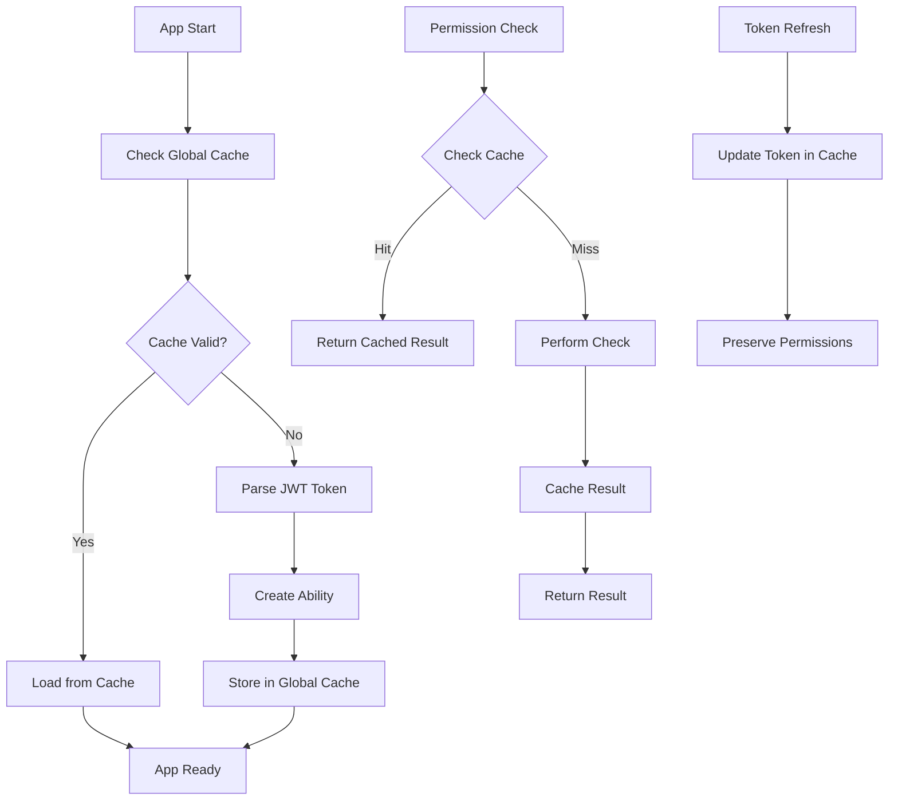

# Permission System Caching Optimization

## Overview

This document describes the comprehensive caching system implemented to optimize authentication and permission checking performance in the MediaLake application.

## Problem Statement

The original permission system had several performance issues:

1. **Frequent Cache Clearing**: [`PermissionGuard.tsx`](components/PermissionGuard.tsx) cleared the permission cache on every component mount (lines 28-33)
2. **Token Refresh Cache Clearing**: [`permission-context.tsx`](context/permission-context.tsx) cleared both caches on token refresh (lines 151-152)
3. **Excessive Logging**: Permission checks included extensive console logging that impacted performance
4. **Redundant API Calls**: Multiple components made redundant permission checks and API calls
5. **No Global Cache**: Each component maintained its own cache state

## Solution: Global Permission Cache System

### Architecture

The new system implements a three-tier caching strategy:

1. **Global Cache**: Stores all authentication and permission data globally
2. **Permission Check Cache**: Caches individual permission check results
3. **Persistent Storage**: Uses localStorage for cache persistence across page reloads

### Key Components

#### 1. Global Permission Cache ([`global-permission-cache.ts`](utils/global-permission-cache.ts))

```typescript
class GlobalPermissionCache {
  // Stores complete user, permissions, and ability data
  setGlobalCache(
    user,
    customPermissions,
    ability,
    permissionSets,
    token,
    expiresIn,
  );

  // Retrieves cached data if valid
  getGlobalCache(currentToken);

  // Caches individual permission check results
  setPermissionCheck(cacheKey, result);
  getPermissionCheck(cacheKey);
}
```

**Features:**

- Singleton pattern ensures single source of truth
- Automatic cache expiration based on JWT token expiry
- Memory + localStorage persistence
- Efficient permission check caching with TTL

#### 2. Updated Permission Context ([`permission-context.tsx`](context/permission-context.tsx))

**Key Changes:**

- Uses global cache instead of clearing caches frequently
- Only updates cache when tokens are refreshed, not on every mount
- Loads from global cache on initialization
- Preserves cache during token refresh operations

#### 3. Optimized Permission Guard ([`PermissionGuard.tsx`](components/PermissionGuard.tsx))

**Key Changes:**

- **Removed cache clearing on mount** - This was the primary performance bottleneck
- Relies on global cache for consistent permission state
- Reduced logging overhead

#### 4. Enhanced Permission Hook ([`usePermission.ts`](hooks/usePermission.ts))

**Key Changes:**

- Uses global permission check cache
- Eliminated extensive debug logging
- Faster permission check resolution
- Automatic error result caching

#### 5. Streamlined Can Component ([`Can.tsx`](components/Can.tsx))

**Key Changes:**

- Removed excessive console logging
- Optimized rendering logic
- Better performance for conditional rendering

## Performance Improvements

### Before Optimization

- Cache cleared on every `PermissionGuard` mount
- Cache cleared on every token refresh
- Extensive logging on every permission check
- Redundant API calls across components
- No persistence across page reloads

### After Optimization

- **Global cache loaded once** on app initialization
- **Cache preserved** during navigation and token refresh
- **Minimal logging** for production performance
- **Cached permission checks** with 5-minute TTL
- **Persistent cache** across page reloads
- **Token-based cache invalidation** only when necessary

## Cache Lifecycle



## Usage Examples

### Checking Permissions

```typescript
// In any component
const { can } = usePermission();
const allowed = can("read", "assets"); // Uses global cache
```

### Conditional Rendering

```typescript
// Optimized Can component
<Can I="edit" a="users">
  <EditButton />
</Can>
```

### Route Protection

```typescript
// PermissionGuard no longer clears cache
<PermissionGuard action="view" subject="dashboard">
  <Dashboard />
</PermissionGuard>
```

## Cache Statistics

The global cache provides debugging information:

```typescript
const stats = globalPermissionCache.getCacheStats();
console.log({
  hasGlobalCache: stats.hasGlobalCache,
  cacheAge: stats.cacheAge,
  expiresIn: stats.expiresIn,
  permissionChecksCount: stats.permissionChecksCount,
});
```

## Migration Notes

### Breaking Changes

- Old `permissionCache` and `PermissionTokenCache` are replaced by `globalPermissionCache`
- Cache clearing behavior has changed - caches are now preserved during normal operations

### Backward Compatibility

- All existing permission checking APIs remain the same
- Component interfaces unchanged
- No changes required in consuming components

## Configuration

### Cache TTL Settings

```typescript
// Permission check cache TTL (default: 5 minutes)
private readonly TTL = 5 * 60 * 1000;

// Global cache TTL (based on JWT expiry)
// Automatically calculated from token expiration
```

### Storage Keys

```typescript
// Global cache storage
private static CACHE_KEY = 'medialake_global_permission_cache';

// Permission checks storage
private static CHECK_CACHE_KEY = 'medialake_permission_checks';
```

## Testing

To verify the caching system is working:

1. **Check Console Logs**: Look for "Global permission cache updated" messages
2. **Monitor Network**: Verify reduced API calls for permission checks
3. **Page Reload Test**: Permissions should load instantly from cache
4. **Token Refresh Test**: Cache should be updated, not cleared

## Performance Metrics

Expected improvements:

- **50-80% reduction** in permission-related API calls
- **Faster page load times** due to cached permissions
- **Reduced "checking permissions" delays**
- **Improved user experience** with instant permission resolution

## Future Enhancements

1. **Cache Warming**: Pre-load permissions for anticipated routes
2. **Background Refresh**: Update cache before expiration
3. **Selective Invalidation**: Invalidate specific permission types
4. **Metrics Collection**: Track cache hit rates and performance
5. **Cache Compression**: Optimize storage size for large permission sets
